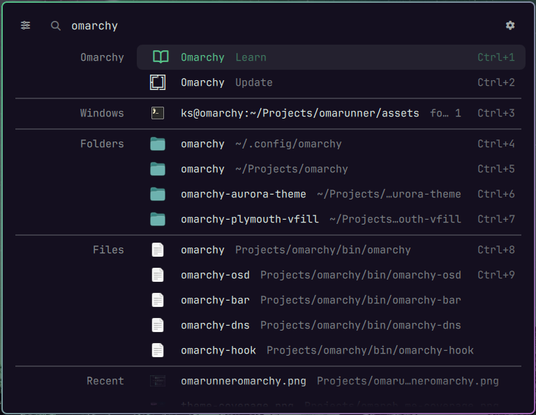
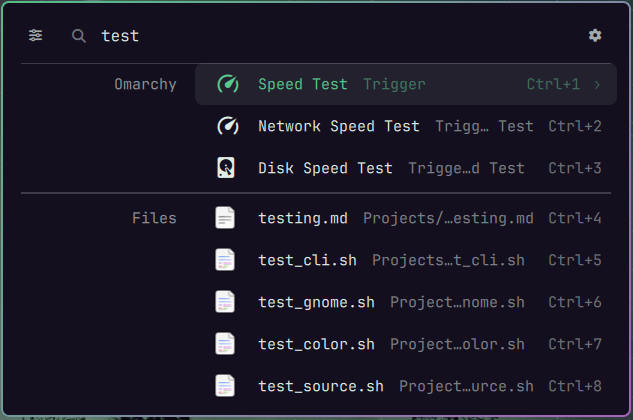
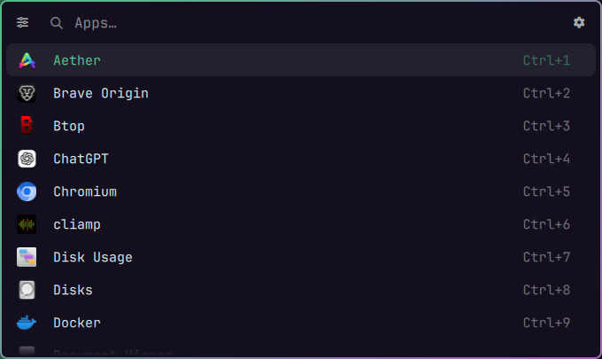
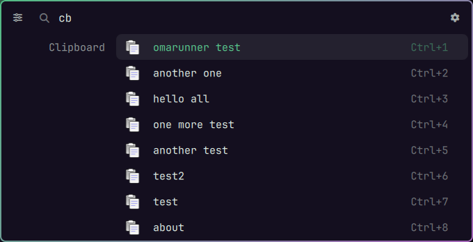
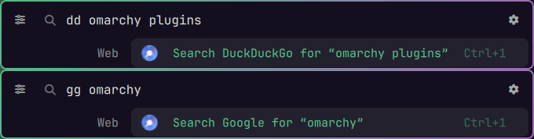
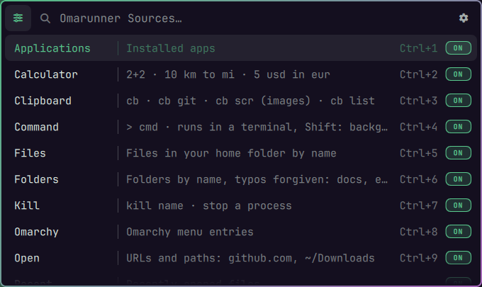
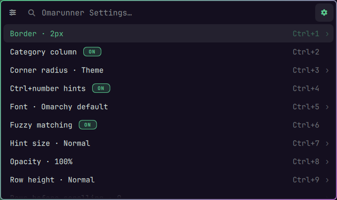

# omarunner

A KRunner-style launcher for Omarchy. It replaces the Omarchy
root menu on `SUPER + SPACE`: with nothing typed it is one input line, and the
first keystroke expands it into results grouped by kind, with the group name in
a column on the left: applications, the whole Omarchy menu tree, session actions,
folders, files, recent files, open windows, a calculator with unit conversion,
and more. The first nine results launch with `Ctrl+1` to `Ctrl+9`.

It is a fork of the first-party `omarchy.menu` plugin, so it follows the active
Omarchy theme with no configuration.

## Screenshots

<div align="center">

<br>
<sub>Collapsed: one input line</sub>

<br>
<sub>Results grouped by kind, with Ctrl+number quick launch</sub>

<br>
<sub>Menu entries and files</sub>

<br>
<sub>The Apps list</sub>

<br>
<sub>Clipboard history behind the cb prefix</sub>

<br>
<sub>Web search with dd and gg</sub>

<br>
<sub>The Omarunner Sources page</sub>

<br>
<sub>The Omarunner Settings page</sub>

</div>

## Requirements

- Omarchy 4 with its Lua Hyprland config (`~/.config/hypr/bindings.lua`) and the
  Omarchy shell (Quickshell). Verified on Omarchy 4.0.4-1 with Hyprland 0.56.
- Older Omarchy releases that configure Hyprland through `hyprland.conf` are not
  supported: the keybinding steps below do not apply there, and focusing a
  window from the Windows results uses Hyprland's Lua dispatcher.

## Installation

omarunner is a standard Omarchy shell plugin. Add it, then run the setup step
to choose its keys:

```bash
omarchy plugin add https://github.com/thevideinfra/omarunner.git --enable
~/.config/omarchy/plugins/videinfra.omarunner/bin/omarunner-setup
```

The first command clones the plugin into
`~/.config/omarchy/plugins/videinfra.omarunner`, validates it and enables it. The
second asks for the keys (see Keybindings below).

Optional packages (the setup step names any that are missing):

- `libqalculate` (provides `qalc`): unit, currency and function support in the
  calculator. Plain arithmetic works without it.
- `fzf`: fuzzy ranking for file search. Without it, file search matches names
  literally.

```bash
sudo pacman -S libqalculate fzf
```

## Updating

```bash
omarchy plugin update videinfra.omarunner
```

Your keybindings survive an update. If you ever remove and re-add the plugin,
run `omarunner-setup` or `omarunner-apply` once to regenerate them: your keys are
kept in `~/.config/omarchy/omarunner.json`, but the generated `omarunner.lua`
lives in the plugin folder and goes with it.

## Keybindings

A plugin cannot declare keys itself, so omarunner has a setup step:

```bash
~/.config/omarchy/plugins/videinfra.omarunner/bin/omarunner-setup
```

It asks which key opens omarunner (default `SUPER + SPACE`, which replaces
Omarchy's menu key) and whether to bind a second key for the Apps list
(`SUPER + ALT + SPACE`). It then:

- saves the answers under `keys` in `~/.config/omarchy/omarunner.json`;
- generates `omarunner.lua` in the plugin folder and adds one `pcall(dofile, …)`
  line to `~/.config/hypr/hyprland.lua` (backed up first, harmless if the plugin
  is removed), then reloads Hyprland;
- offers to put the `omarunner` command on your PATH (a link in
  `~/.local/bin`), so you can run `omarunner toggle` from a terminal. The keys
  themselves do not need it.

Re-run it any time, or use **Keybindings…** on the Omarunner Settings page. The
bar's Omarchy button and `SUPER + CTRL + SPACE` keep opening the Omarchy menu.

For scripts: `omarunner-setup --yes --launcher "SUPER + R" --apps none` (add
`--no-path` to skip the PATH link), and `omarunner-apply` to regenerate the binds
from `omarunner.json`. Both live in the plugin's `bin/` folder.

Prefer to write the binds yourself? Add these to `~/.config/hypr/bindings.lua`
instead, then run `hyprctl reload`:

```lua
-- omarunner replaces the Omarchy root menu on SUPER+SPACE (was: Omarchy menu).
-- The bar's Omarchy logo button and SUPER+CTRL+SPACE (background switcher)
-- stay on omarchy-menu.
local omarunner = "$HOME/.config/omarchy/plugins/videinfra.omarunner/bin/omarunner"
hl.unbind("SUPER + SPACE")
o.bind("SUPER + SPACE", "omarunner", omarunner .. " toggle")
hl.unbind("SUPER + ALT + SPACE")
o.bind("SUPER + ALT + SPACE", "omarunner apps", omarunner .. " toggle apps")
```

## Usage

The `omarunner` command drives the plugin from a terminal or a keybinding:

```
omarunner [toggle|summon|close|refresh|ping|setup|apply] [route]
```

`toggle` is the default verb and `root` the default route. A route is a menu item
id (`setup.power`) or an alias (`power`), the same routes `omarchy-menu` accepts,
plus `sources` and `omarunner-settings` for omarunner's own pages. `setup` and
`apply` run `omarunner-setup` and `omarunner-apply`.

## Uninstallation

Take the keys out first, then remove the plugin:

```bash
~/.config/omarchy/plugins/videinfra.omarunner/bin/omarunner-apply --remove
omarchy plugin remove videinfra.omarunner
```

`omarunner-apply --remove` deletes the loader line from `hyprland.lua`, the
generated `omarunner.lua` and the PATH link, then reloads Hyprland, which
restores Omarchy's own keys. If you wrote the binds by hand instead, remove those
lines from `bindings.lua` (the `local` line, the `hl.unbind` lines and the
`o.bind` lines) and run `hyprctl reload`.

## Development

Clone the repo and install it from the clone, as a user would, so you test what
users get:

```bash
git clone https://github.com/thevideinfra/omarunner.git ~/Projects/omarunner
omarchy plugin add ~/Projects/omarunner --enable
```

To try a change, commit it in the clone, update the installed copy from it and
restart the shell. The update pulls from the plugin's origin, which is your
clone, so uncommitted edits do not reach the installed plugin:

```bash
cd ~/Projects/omarunner && git commit -am "..."
omarchy plugin update videinfra.omarunner
omarchy-restart-shell
```

To undo a tried change, `git revert` it and update again.

Run the unit tests with `npm test`. They cover the pure logic of every source
(`*Model.js`), row building and grouping in `RunnerModel.js`, the settings model,
the keybinding scripts, the structure of the QML files and the CLI.

A search source is a QML file exposing `sourceId`, `groupLabel`, `hint`,
`maxRows`, `enabled`, `search(query, serial)`, `activate(value, modifiers)` and
`signal results(int serial, var rows)`, optionally `claims(query)` (a prefix
source), `leading` (rows above the menu groups) or `fallback` (rows only when
nothing else matched). Add the instance to `root.sources` in `Runner.qml`; the
Sources page picks it up from there.

`bin/omarunner-diff-upstream` compares the installed first-party menu plugin
against the vendored baseline in `upstream/`, which is how drift after an Omarchy
update becomes visible.

## Applications

Application rows come from Quickshell's `DesktopEntries`, read by `AppSource.qml`
through the pure helpers in `AppModel.js`, and filtered by the same
`default/omarchy/launcher.hides` list the Omarchy launcher uses. The shell's
shared `AppLibrary` is not reachable from a third-party menu plugin, so the
runner keeps its own source; the visible difference is that launching from
omarunner does not raise the shell's launch OSD.

## What you can type

Results are grouped. Calculator and Open rows sit at the top; then Omarchy,
Applications and Session, whichever holds the best match first; then Windows,
Folders, Files and Recent. A search that matches nothing offers a web search.

| Type | Example | Enter | Shift+Enter |
|---|---|---|---|
| Apps, Omarchy menu | `firefox`, `theme` | launch / open | — |
| Session | `lock`, `sleep`, `restart`, `power off` | run it | — |
| Calculator | `2+2*3`, `=2` | copy the result | copy the result |
| Unit conversion (qalc) | `10 km to mi`, `100f to c`, `5 usd in eur`, `20% of 300` | copy the result | copy the result |
| Open | `github.com/x`, `https://…`, `localhost:8080`, `~/Downloads`, `/etc` | open it | copy the URL / reveal the folder |
| Folders | `documents`, `docmuents`, `etc`, `hypr` | open the folder | terminal in the folder |
| Files | `bindlua`, `invoice pdf` | open the file | reveal its folder |
| Recent | `recent` (the newest files), `recent report`, or part of a recently opened file's name | open | reveal its folder |
| Windows | part of a window title or app name | focus it | focus it |
| Command | `> htop` | run in a terminal | run in the background |
| Kill | `kill firefox` | `kill` (SIGTERM) | `kill -KILL` |
| Clipboard | `cb`, `cb git`, `cb scr` (images), `cb list` | paste into the previous window | copy only |
| Web | `dd query`, `gg query`, `yt query`, `wiki query` | open in the browser | copy the URL |

Prefixes (`cb`, `>`, `kill`, `recent`, `dd`/`gg`/`yt`/`wiki` followed by a query)
hand the whole list to that one source. Clipboard history appears only behind `cb`, so
copied secrets never show in an ordinary search.

Folder names forgive case and small typos. With fuzzy matching on (the
default), letters typed in order also match: `frfox` finds Firefox, and files are
ranked by `fzf`.

## Keys

| Key | Action |
|---|---|
| `Ctrl+1` … `Ctrl+9` | launch that row (add Shift for its Shift action) |
| `Enter` / `Shift+Enter` | launch the selected row / its alternate action |
| `Up` / `Down`, `PageUp` / `PageDown` | move the selection |
| `Escape` | clear the query, then close; on the Sources or Settings page, go back |
| `Backspace` / `Left` on an empty query | back out of a submenu |
| `Ctrl+P` | pin or unpin the selected result (Favorites) |
| `Ctrl+Up` / `Ctrl+Down` on Settings → Favorites | move the pinned item up or down |
| `Ctrl+,` or the filter button (top left) | Sources page, press again to close |
| `Ctrl+S` or the gear (top right) | Settings page, press again to close |

Shift+click works like Shift+Enter.

## Sources and settings

The **Omarunner Sources** page (filter button, `Ctrl+,`) lists every search source with a short hint and an
**ON**/**OFF** badge at the right; Enter or a click toggles one. Applications,
Omarchy and Session can be switched off the same way.

The **Omarunner Settings** page (gear, `Ctrl+S`) holds: accent colour, border,
category column, corner radius, Ctrl+number hints, Favorites, font, fuzzy
matching, hint size, location, opacity, Recent launches, row height, rows before
scrolling, text size, the version and GitHub link, and width. On/off settings show an **ON**/**OFF** badge after their
name; a choice (open it to see the presets, the current one has a dot) offers
presets and a **Custom…** entry: open the setting and type a value (a number in
the range the row names, a font name, or a `#rrggbb` colour for the accent),
then pick the **Use …** row.

The **accent colour** is the theme's own by default; pick another colour from the
theme's palette, or type a hex colour. It colours the selected row, the
ON/OFF badges and the choice dots. While Settings is open, the header shows the
version and a GitHub icon beside the gear; the icon opens the project on GitHub.
Turn it off with **Version and GitHub link**.

**Location** puts the launcher in the centre of the screen (default) or at the
top, a fifth of the way down; results grow downward from there.

**Favorites** are results you pin with `Ctrl+P` (apps, files, folders, menu
entries). They are listed under a *Favorites* heading whenever omarunner opens
with nothing typed. Settings → Favorites lists them: Enter unpins one, and
`Ctrl+Up` / `Ctrl+Down` reorders. Open Favorites to switch
the start-screen list **ON**/**OFF** (on by default) and pick how many show (3, 5, 8,
All or a typed number).

**Recent launches** (a switch, off by default, with 3, 5, 8 or a typed number to show) lists what you launched
last, under the favorites, instead of the bare input line. Only apps, files,
folders and menu actions are recorded: never clipboard entries, typed commands,
kill, calculator or web searches. Favorites and history live in
`~/.local/state/omarunner/history.json`.

Both pages are stored in `~/.config/omarchy/omarunner.json` (`sources`,
`settings`, and `webSearchUrl` for the fallback web search, DuckDuckGo by
default). Hand edits to an existing file are picked up while the shell runs; if
the file is first created after the shell started, restart the shell (or toggle
something once) for edits to be watched. If the file is not valid JSON,
omarunner uses defaults and, on the next change, copies the broken file to
`omarunner.json.bak` before writing a fresh one.

## Relationship to omarchy.menu

The first-party `omarchy.menu` plugin stays installed and untouched. It still
serves the Omarchy logo button in the bar, the `SUPER + CTRL + SPACE` background
switcher, and the `omarchy-menu-select` / `omarchy-menu-input` dmenu helpers,
which omarunner deliberately does not implement.

## Credits

omarunner is a fork of the `omarchy.menu` plugin from
[Omarchy](https://github.com/omacom/omarchy) by David Heinemeier Hansson, and
would not exist without it. `Runner.qml` and `RunnerModel.js` descend from
Omarchy's `Menu.qml` and `MenuModel.js`, and `upstream/` keeps the unmodified
originals to track changes. Omarchy is MIT licensed; its copyright notice and
license text are in [`NOTICE`](NOTICE). The launcher design borrows from KDE's
KRunner and the COSMIC launcher.

## License

MIT, see [`LICENSE`](LICENSE). Third-party notices are in [`NOTICE`](NOTICE).

## Verified on

Omarchy 4.0.4-1.
